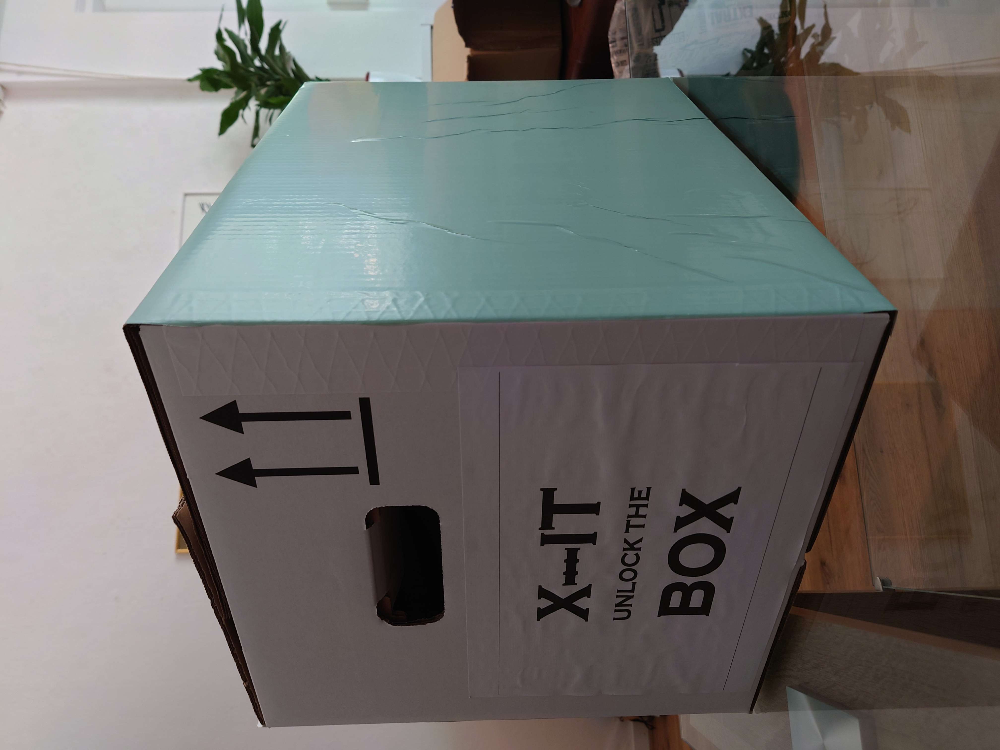
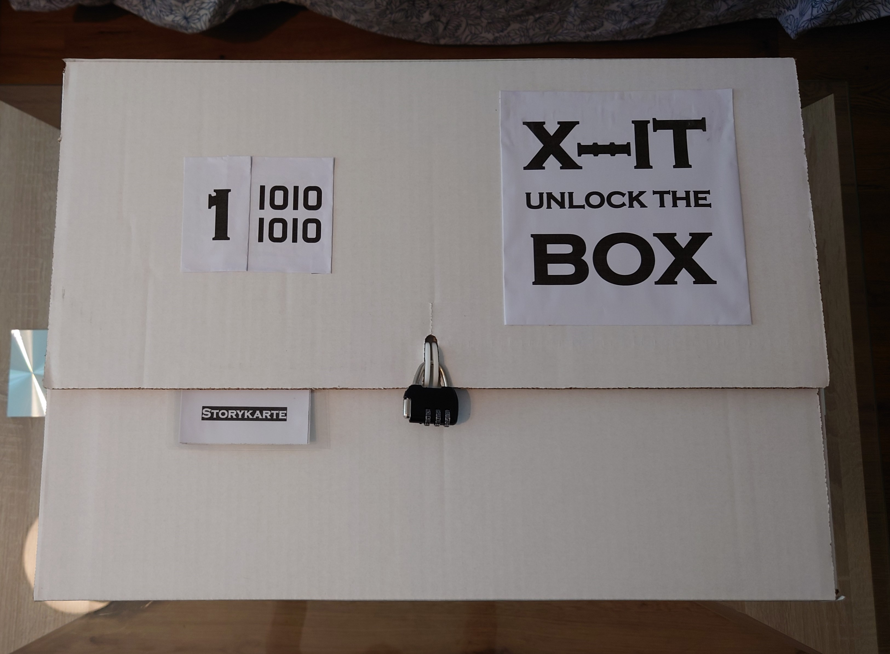
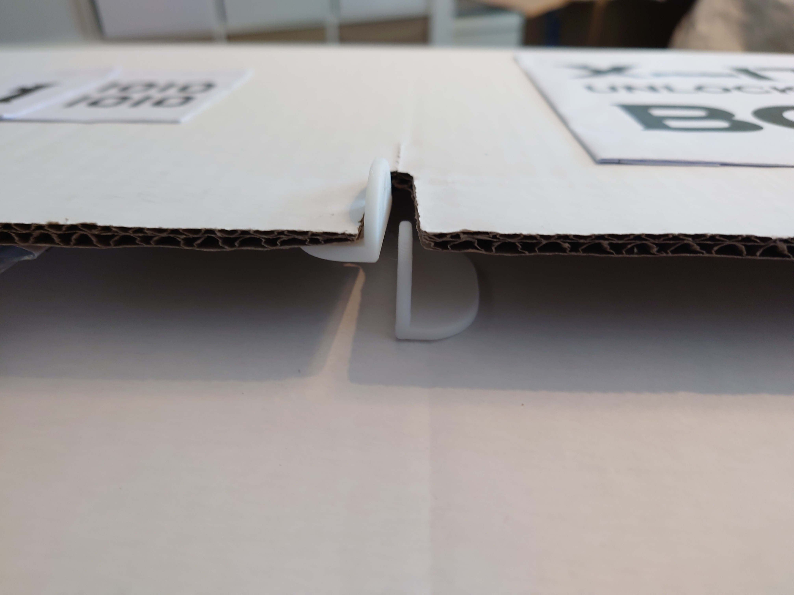
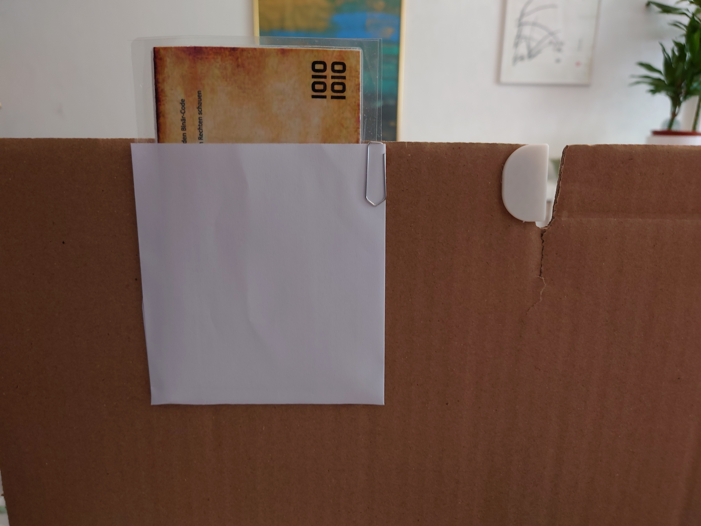
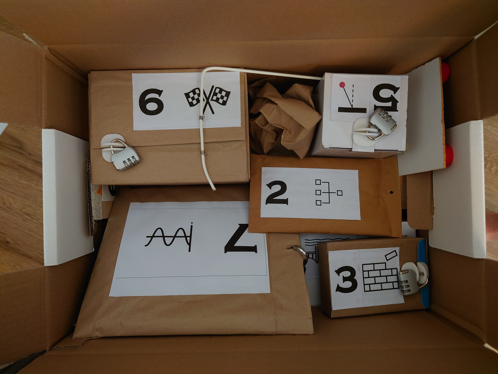
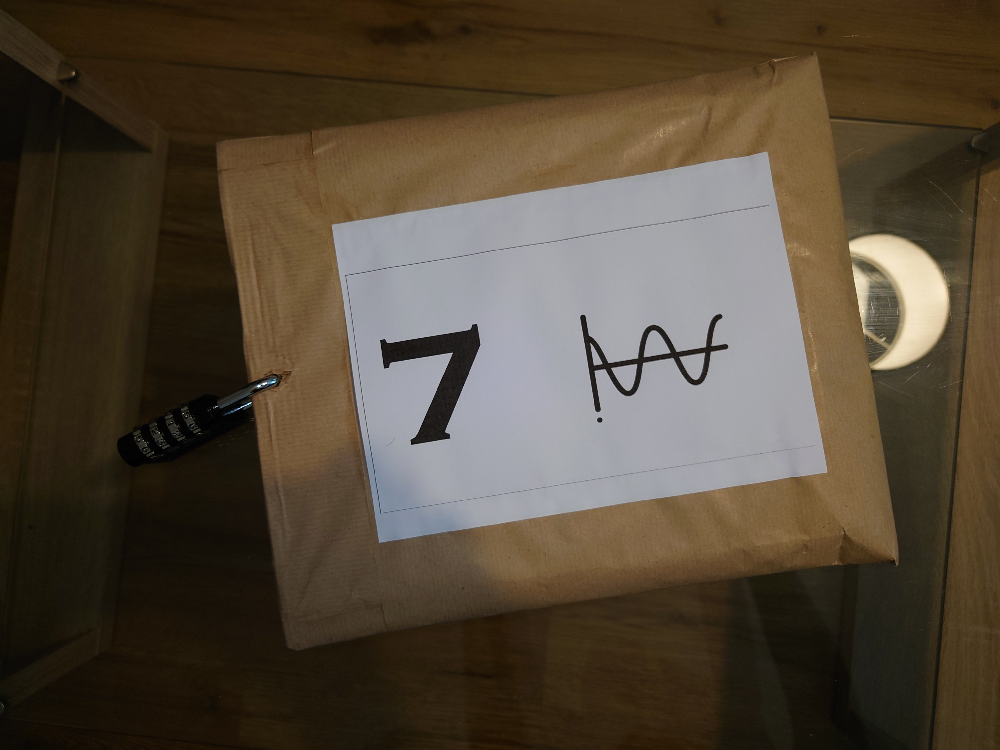
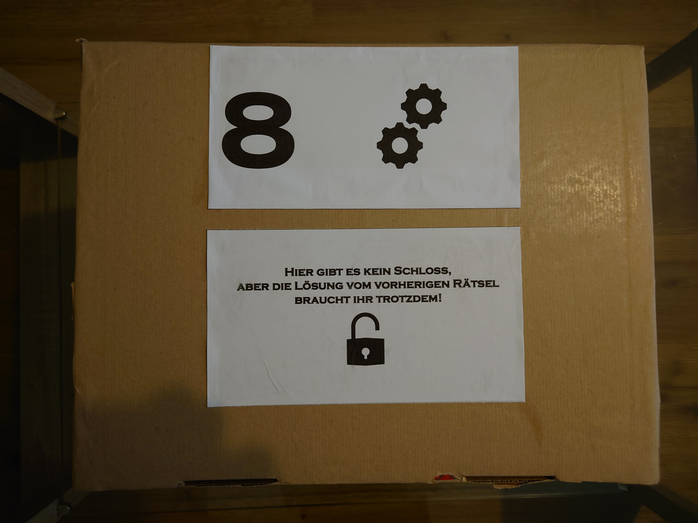

## X-IT Box (äußere Box, die alle Rätsel enthält) und allgemein benötigte Materialien
Hier geht es darum, wie ihr die tatsächliche Box gestalten könnt. Wie immer, sind der Kreativität keine Grenzen gesetzt. Wir haben uns für eine Umzugskarton-Box (Bauhaus Cargos S) entschieden, die wir mit einem Logo und einem Zahlenschloss versehen haben und mit MINT-grüner Klebefolie dekoriert haben. Ihr könnt aber auch eine andere Box verwenden, die ihr schön findet. Auf der Außenbox muss auch noch das erste Rätsel platziert werden, damit die Spieler\*innen wissen, wo sie anfangen sollen. Wor haben dazu eine Tasche unter den Deckel geklebt (siehe Bilder).

Für die inneren Rätselboxen (die Boxen, die die Rätsel enthalten) könnt ihr ebenfalls kreativ sein. Wir haben alle möglichen passenden Kartons zusammengesucht und in braunen Packpapier eingeschlagen. Dann haben wir die Rätsellogos und Aufsätze für die Vorhängeschlösser aufgeklebt.

# Außenbox

## Materialien
- 1x Umzugskarton L x B x H: 50 x 35 x 37 cm
- 2x Logo
- 2x Aufsatz Vorhängeschloss
- 1x Zahlenschloss mit 3 Ziffern
- Flüssigkleber (Bastelkleber)
- Heißkleber (zum Kleben der Aufsätze)
- evtl. Klebfolie zur Gestaltung der Box
- ggf. Büroklammer (zur Befestigung der Rätselkarten)

## Bilder

Design der Außenbox mit Logo und Klebefolie.

Design der Oberseite der Außenbox mit Logo und Zahlenschloss sowie Rätsellogo.

Verschluss der Außenbox mit Aufsatz für das Zahlenschloss.

Tasche für das erste Rätsel.

# Innere Rätselboxen

## Materialien

- 1x passende Rätselbox
- 1 Rätsellogo
- 2 Aufsatz Vorhängeschloss
- 1 Zahlenschloss mit 3 Ziffern, außer:
  - Rätsel 2: Hier ist kein Zahlenschloss nötig, weil die Box mit einem Vorhängeschloss gesichert ist
  - Rätsel 7: Hier ist ein Zahlenschloss mit 4 Ziffern nötig, weil die Lösung von Rätsel 6 vierstellig ist
  - Rätsel 8: Hier ist gar kein Zahlenschloss nötig, weil der Code im Rätsel verwendet wird
  - Rätsel 9: Hier ist kein Zahleschloss notwendig, weil nur die Cryptex entriegelt werden muss
- Flüssigkleber (Bastelkleber)
- Heißkleber (zum Kleben der Aufsätze)

## Bilder

Packung der Rätselboxen.

Beispiel Rätselbox 4.

Beispiel Rätselbox 7.

Beispiel Rätselbox 8.

# Extras zur potentiellen Weiterentwicklung der Rätsel
- [Feedbackbogen](Feedbackbogen.pdf) (ausfüllbares Dokument, sowie unsere Feedbackauswertung, die bei der Rätselentwicklung Einfluss genommen haben)
- [Karten-Vorlage-PowerPoint-Datei](Karten-Vorlage.pptx) um die Selbstgestaltung von Rätselkarten zu ermöglichen
