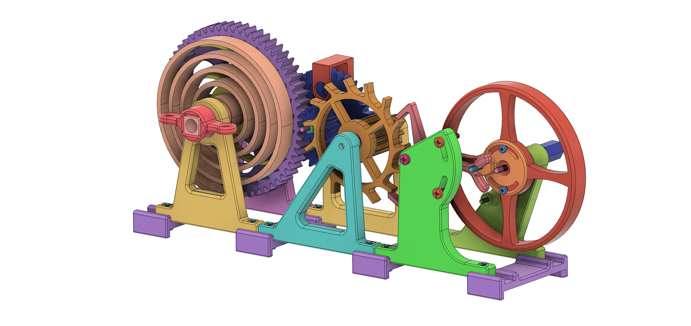

# Rätsel 8 – Uhrwerk



## Ziel des Rätsels

Das Ziel dieses Rätsels ist es, ein echtes mechanisches Uhrwerk begreifbar zu machen. Die Spielenden erleben an einem voll funktionsfähigen 3D-gedruckten Modell, wie ein sogenannter *Escapement Mechanism* (dt. Hemmwerk) funktioniert – ein zentraler Bestandteil jeder mechanischen Uhr. Dabei geht es darum, durch das richtige Einstellen von Trägheitsmomenteine kontrollierte Schwingung zu erzeugen und so mechanische Zeit sichtbar zu machen. Das Uhrwerk „tickt“ nur, wenn alle Bedingungen stimmen.

Die Lernenden sollen:
- das Zusammenspiel von Trägheitsmoment und Frequenz verstehen,
- das Prinzip mechanischer Zeitregelung durch Oszillatoren (Schwungrad) entdecken,
- selbst beobachten, wann und wie sich die Mechanik öffnet – und damit die Lösung sichtbar wird.

---
## Swiss Lever Escapement mit Schwungrad

**Spielweise:**  
Die Spielenden müssen zunächst das Uhrwerk zusammenbauen, indem sie das passende Schwungrad auswählen und einsetzen. Dabei hilft die Lösung des vorherigen Rätsels.
Die Spielenden starten das Uhrwerk, indem sie das Zahnrad mit den Ziffern auf die rote Startmarkierung setzen, das Uhrwerk aufziehen und starten lassen.  
Sie beobachten das rotierende Hemmrad und lesen alle zwei Sekunden einen Wert ab.

**Aufbau:**  
Das Rätsel ist bereits fast vollständig aufgebaut. Der Mechanismus ist zu fein und komplex, um ihn innerhalb des Spiels eigenständig durch die Spielenden zusammenzubauen.  
Wird das Uhrwerk falsch konfiguriert (falsches Trägheitsmoment am Schwungrad), funktioniert es nicht oder läuft in falscher Frequenz.

**Lerneffekt:**
Ein Uhrwerk ist ein komplexer und geheimnisvoller Mechanismus aus vielen kleinen Schrauben, Federn und Zahnrädern, der den meisten Menschen auf ewig ein Geheimnis bleibt. In diesem Rätsel geht es darum, diesen mysteriösen Mechanismus verständlich und greifbar zu machen. Dazu haben wir den *Swiss Lever*, wie er in allen gängigen Armbanduhren zu finden ist, aus möglichst wenigen Komponenten nachgebaut. So lässt sich die Funktion leicht erklären und spielend entdecken. Gleichzeitig werden verschiedenste Prinzipien der Mechanik angewendet, vor allem der Kinetik und Kinematik. Indem die Spielenden selber das Schwungrad auswählen und einsetzen, wird Ihnen der Effekt des Trägheitsmoments auf die Frequenz des Uhrwerks nahegebracht. Damit schließt dieses Rätsel direkt an das Vorherige, die rollenden Körper, an.

---

## Didaktischer Hintergrund

- Trägheitsmoment und Rotationsbewegung (Swiss Lever)
- Pendelgesetze: $T = 2\pi\sqrt{l/g}$ (Pendelversion)
- Energieübertragung und Hemmwirkung im Uhrwerk
- Anwendung von Vorwissen: Die Lösung des vorherigen Rätsels ist notwendig, um den Mechanismus korrekt zu konfigurieren

---

## Inhalte im Ordner

```plaintext
Rätsel 8 - Uhrwerk/
├── README.md
└── material/
    ├── Aufkleber Box.pdf
    ├── Rätselkarte.pdf
    ├── Storykarte.pdf
    ├── Lösungskarte.pdf
    ├── fusion360/
    │   └── watch_escapement_puzzle.f3d
    ├── step/
    │   └── watch_escapement_puzzle.step
    └── stl/
        └── ...
```
---

## Aufbauanleitung

### Werkzeuge
- 3D-Drucker (mind. 130 x 130 x 70 mm Bauvolumen)
- Schraubendreher (Kreuzschlitz) oder
- Inbusschlüssel
- Zange oder Schraubenschlüssel (5,5 mm und 7 mm)
- evtl. Akkubohrer + 4 mm Metallbohrer
- kleiner Pinsel
- Schleifpapier (Körnung 100, 120, oder 180)
- Messer (zum Nachbearbeiten der Druckteile)

### Materialliste

#### Allgemein

- 1x Holzplatte (ca. 18 x 120 x 360 mm)
- 4x Holzschraube (ca. 3,5 x 25 mm
- Acrylfarbe (z.B. schwarz oder rot)
- evtl. Papier (als Abstandshalter)
- evtl. Heißkleber

> Schrauben
> Du kannst Zylinderkopf-, Senkkopf- oder Linsenkopfschrauben mit Innensechskant oder Kreuzschlitz verwenden. Achte drauf, dass du das passende Werkzeug für deine Schrauben hast.  

#### Metallteile
- 15x M4x20 Schraube
- 20x M4 Mutter
- 3x M4 Sicherungsmutter
- 3x M4x60 Schraube
- 1x M4x50 Schraube
- 1x M4x40 Schraube
- 10x M4 Unterlegscheibe
- 6x M3x12 Schraube
- 3x M3x25 Schraube
- 7x M3 Mutter
- (2x 6242Z bzw. 624ZZ Kugellager)
---
#### 3D-Druck-Bauteile

> Druckeinstellungen & Material
> Die meisten Teile können aus PLA gedruckt werden. Für die Federn und das Schwungrad empfehlen wir jedoch PETG, PCTG oder PLA+ für eine höhere Flexibilität und Haltbarkeit. Andernfalls können sich die Federn dauerhaft verformen oder sogar brechen.
> 
> **Druckeinstellungen:**
> - Düsendurchmesser: 0,4 mm
> - Schichthöhe: 0,2 mm
> - Wandstärke: 0,8 mm (außer bei Schwungrad, hier 1,2 mm)
> - Fülldichte: 15 % (außer bei Federn hier 100 %)
>
> Alle Teile sind schon richtig orientiert und können direkt gedruckt werden. Support oder ein Brim ist i.d.R. nicht nötig, es sei denn, es ist explizit angegeben. Wenn du Probleme mit der Passgenauigkeit hast, dann kannst du das im Slicer korrigieren (z.B. *Horizontal Expansion* in *Cura*). Die Löcher kannst du aber auch einfach mit einem 4 mm Bohrer nachbearbeiten, falls sie zu eng sind.

#### Rahmen
- 4x Bracket

#### SpringFrame

- 1x SpringFrameFront
- 1x SpringFrameBack v4
- 1x SpringBarrel
- 1x Ratchet
- 1x MainSpring (bevorzugt PLA+, PETG, oder PCTG)
- 1x WindingStem v2 (mit Support drucken)
- 1x WindingKey

#### TrainFrame

- 1x TrainFrameFront v2
- 1x TrainFrameBack v3 (mit Support drucken)
- 1x GearTrain v3
- 1x EscapeWheel (oder v2, falls 6242Z Kugellager vorhanden)
- 1x Marker

#### BalanceFrame

- 1x BalanceFrameFront v3
- 1x BalanceFrameBack
- 1x PalletFork v2
- 1x ImpactPinHousing v2
- 1x Knob
- 1x Hairspring (bevorzugt PLA+, PETG, oder PCTG)
- 1x Balance v2
- 1x BalanceHeavy v2
- 1x BalanceLight v2

### Zusammenbau

1. Bereite die Holzplatte vor. Du kannst entweder eine zugeschnittene Holzplatte im Baumarkt kaufen, oder du nimmst eine alte Holzplatte und schneidest sie ganz ungefähr auf die Maße 18 x 120 x 360 mm zu. Wichtig ist, dass die Platte nicht verzogen ist, sonst wird das Uhrwerk nicht richtig funktionieren.
2. Schleife die Holzplatte ab, damit sie keine Splitter hat und entgrate die Kanten.
3. Drucke die Bauteile aus dem Ordner `material/stl` mit den oben genannten Druckeinstellungen. Achte darauf, dass du die Federn und das Schwungrad aus PETG, PCTG oder PLA+ druckst, um eine höhere Flexibilität und Haltbarkeit zu gewährleisten. PLA geht zur Not auch, aber evtl. halten die Federn nicht lange.
4. Überprüfe die Bauteile auf Passgenauigkeit und entferne ggf. Stützmaterial und entgrate die Kanten. Eventuell musst du die Löcher noch nachbohren, falls sie zu eng sind. Am besten streichst du die Bauteile in deiner Materialliste ab, damit du den Überblick behältst.
5. Die Ziffern auf dem GearTrain sind noch nicht so gut zu lesen. Jetzt kannst du sie mit Acrylfarbe anmalen. Wenn du willst, kannst du auch den Marker anmalen, sodass er sich besser abhebt. Lass die Farbe gut trocknen, bevor du weiter machst.
6. Jetzt kannst du alles zusammenbauen. Folge dazu der Abbildung oder den Explosionszeichnungen auf [Thingiverse](https://www.thingiverse.com/thing:3364860). Achte darauf, dass du die Schrauben nicht zu fest anziehst, damit die Bauteile sich noch bewegen können.
7. Jetzt kannst du das Uhrwerk auf die Holzplatte schrauben. Damit stabilisierst du es und verhinderst, dass die Zahnräder springen. Außerdem kannst du den Abstand zwischen dem *Escapement Wheel* und dem *Pallet Fork* einstellen, indem du Papier unter das Uhrwerk schiebst und mit etwas Heißkleber fixierst. In unserem Fall waren etwa 8 Blätter Papier nötig, damit das Uhrwerk mit dem mittleren Schwungrad funktioniert.
8. Sobald das Uhrwerk mit dem mittleren Schwungrad funktioniert, kannst du das Zahnrad mit den Ziffern auf die rote Startposition stellen, die Feder aufziehen und alle zwei Sekunden die Werte ablesen. Daraus ergibt sich die Lösung des Rätsels, die du auf der Lösungskarte notierst und in der Cryptex einstellst. Es kann sein, dass deine Werte leicht von den hier genannten abweichen, da die Federn nicht immer gleich sind. Das ist aber kein Problem, solange du die richtigen Werte für die Lösung verwendest.

Der Zusammenbau des Uhrwerks richtet sich größtenteils nach der Anleitung auf [Thingiverse](https://www.thingiverse.com/thing:3364860). Hier ist eine Übersicht der Änderungen, die wir vorgenommen haben:
- Unterlegscheiben nur noch an beweglichen Teilen
- 20 mm statt 16 mm Schrauben für Brackets
- BarrelRatchet entfernt und SpringFrameBack angepasst
- GearTrain angepasst, damit EscapeWheel nicht gegen Sicherungsmutter stößt
- Zahlen auf GearTrain hinzugefügt, Marker hinzugefügt
- WindingStem verlängert
- TrainFrameBack und TrainFrameFront angepasst
- optionales EscapeWheel mit Kugellager hinzugefügt
- BalanceFrameFront angepasst
- PalletFork mit Fasen versehen
- Loch im ImpactPinHousing vergrößert, um Reibung zu verringern
- Knob für Zusammenbau ohne Werkzeug hinzugefügt
- BalanceHeavy und BalanceLight hinzugefügt, um Trägheitsmoment zu variieren

### Bild vom aufgebauten Uhrwerk


## Credits
Dieses Rätsel basiert auf dem [Watch Escapement Desk Toy von LarkysPrints](https://www.thingiverse.com/thing:3364860) und ist unter der CC BY-NC-SA 4.0-Lizenz geschützt. Wir haben basierend auf den STL-Dateien ein paramtrisches Modell erstellt und einige Anpassungen vorgennommen, um die Funktion zu optimieren und aus dem Anschauungsobjekt ein Rätsel zu gestalten. Die STL-Dateien sind im Ordner `material/stl` zu finden. Die STEP-Datei ist im Ordner `material/step` abgelegt. Eine Autodesk Fusion 360-Datei ist im Ordner `material/fusion360` zu finden.